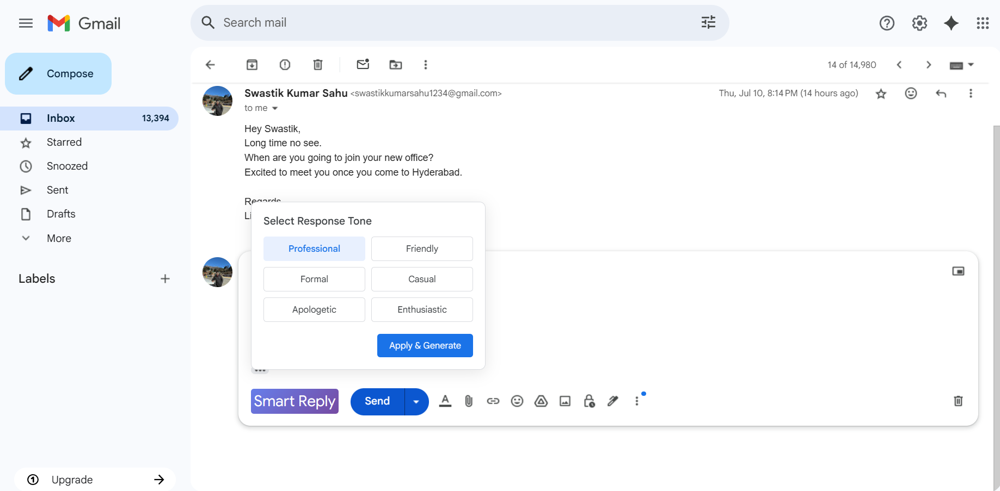
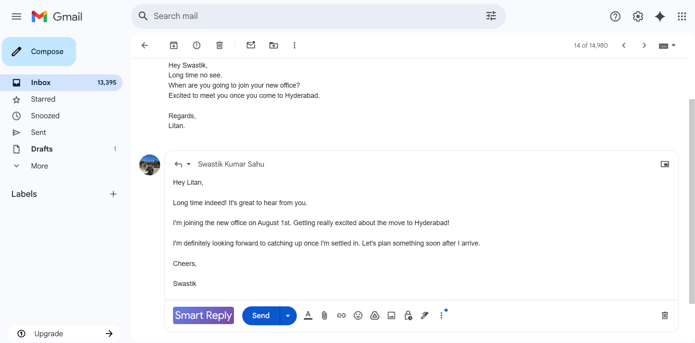

# Mail Mind - AI-Powered Mail Reply Generator

## Description
Mail Mind is an AI-powered email reply generator designed to streamline your email communication within Gmail. By leveraging the power of the Gemini API, Mail Mind analyzes email and generates replies tailored to your preferred tone. The project consists of a Spring Boot backend that handles AI processing and a Chrome extension that integrates seamlessly with Gmail's interface, offering a user-friendly way to generate smart replies with customizable tones.

## Features
* **Customizable Tone Selection:** Choose from multiple tone options (Professional, Friendly, Formal, Casual, Apologetic, Enthusiastic) to match your communication style.
* **Seamless Gmail Integration:** The Chrome extension embeds a "Smart Reply" button in Gmail's compose toolbar, providing a smooth user experience.
* **Dynamic Tone Selector:** A sleek UI for selecting the desired tone, with a grid-based layout for easy navigation.
* **Real-Time Processing:** Communicates with the backend to generate replies quickly, with visual feedback during processing.
* **Error Handling:** Displays user-friendly error messages if reply generation fails, with a retry option.

## Screenshots
Below are some images showcasing Mail Mind in action:

**Tone selector interface for choosing the desired reply tone.**


**Reply generated into Gmail's compose toolbar.**



## Setup Instructions

### Prerequisites
Ensure you have the following installed:

* **Java 17 or higher:** Required for the Spring Boot backend.
* **Spring Boot 3.x:** Framework for the backend.
* **Google Chrome (Latest Version):** Required for the Chrome extension.
* **Gemini API Credentials:** Obtain an API key and URL from [Google AI Studio](https://ai.google.dev/).
* **Node.js and npm (optional, for development):** If you need to modify or build the extension.
* **Gradle:** For building the Spring Boot backend.

### Step 1: Set Up the Backend
1.  **Clone the Repository:**
    ```bash
    git clone https://github.com/Swastik-K-Sahu/Mail-Mind.git
    cd mail-mind/mail-mind-spring
    ```
2.  **Configure Environment Variables:**
    Set the following environment variables in IDE configuration:
    ```
    API_URL=gemini-api-url
    API_KEY=your-gemini-api-key
    ```
    Replace `gemini-api-url` and `your-gemini-api-key` with the API details obtained from Google AI Studio.
3.  **Build and Run the Backend:**
    ```bash
    ./gradlew clean build
    ./gradlew bootRun
    ```
    The backend will start on `http://localhost:8080` (ensure the port matches the `API_ENDPOINT` in `mail-mind.js` within the extension).
4.  **Verify the Backend:**
    Test the API endpoint (`http://localhost:8080/api/mail/compose-reply`) using a tool like Postman with a `POST` request containing:
    ```json
    {
      "emailContent": "Sample email content",
      "tone": "professional"
    }
    ```

### Step 2: Set Up the Chrome Extension
1.  **Load the Extension in Chrome:**
    * Open Google Chrome and navigate to `chrome://extensions/`.
    * Enable **Developer mode** (toggle in the top right).
    * Click **Load unpacked** and select the `mail-mind-extension` directory.
2.  **Verify the Extension:**
    * Open Gmail in Chrome (`https://mail.google.com`).
    * Start composing a reply to an email. You should see the "Smart Reply" button in the compose toolbar.
    * Click the button to open the tone selector, choose a tone, and generate a reply.

### Step 3: Usage
1.  Open Gmail and navigate to an email thread.
2.  Click the "Smart Reply" button in the compose toolbar.
3.  Select a tone from the options (e.g., Professional, Friendly).
4.  Click "Apply & Generate" to create a reply, which will be inserted into the compose box.
5.  Edit the generated reply if needed before sending.

## Notes
* Ensure the backend is running before using the Chrome extension, as it relies on the API for reply generation.
* The extension works only in Gmail and requires an active internet connection.
* If you encounter issues, check the Chrome Developer Tools console (F12) or the backend logs for errors.
